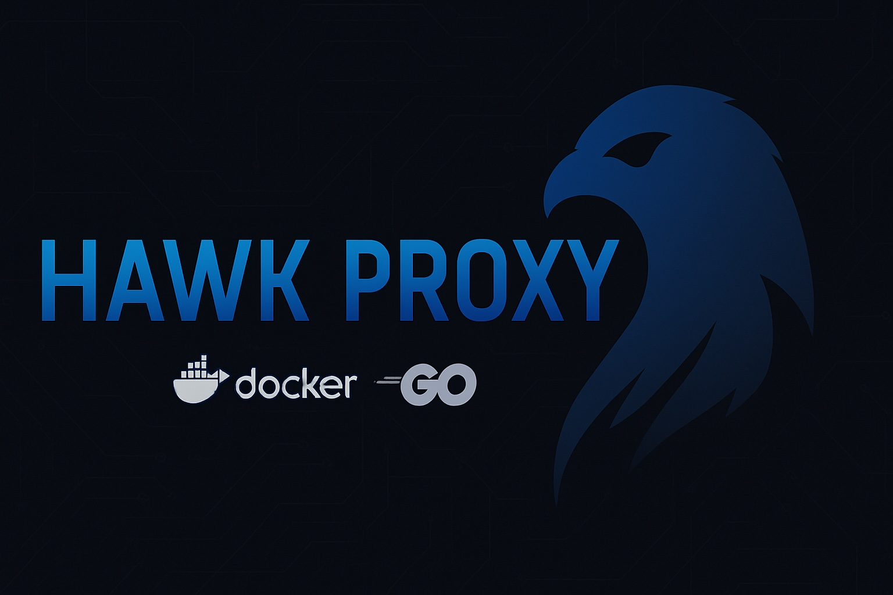

# Hawk Proxy

### 🌐 Simple traffic forwarder through PHP & proxy servers


---

## 👤 Author

**freecyberhawk**

- GitHub: [@freecyberhawk](https://github.com/freecyberhawk)

## 🌟 Show Your Support

If you found this project helpful, please give it a ⭐️ on [GitHub](https://github.com/freecyberhawk/hawk-proxy)!

## 🇬🇧 English

**hawk_proxy** is a lightweight PHP-based traffic redirection system.

It receives incoming HTTP traffic and forwards it to one of the predefined proxy servers (typically hosted on virtual private servers). If the first proxy fails, it automatically tries the next one.

## 📦 1 - Quick Install (VPS)

```bash
bash <(curl -Ls https://raw.githubusercontent.com/freecyberhawk/hawk-proxy/main/install.sh)
````


#### Install Manually Docker (Optionally)
- just if quick method stopped on docker installation!!!
```bash
bash <(curl -Ls https://get.docker.com)
```

## 🔧 2 - Host Config

1. Create a file named `index.php` on your shared hosting or source domain.
2. Paste the following code inside it:
3. Replace the IPs and API key in the `$proxies` and `API_KEY` constants with your own values.

```php
<?php

if ((isset($_SERVER['HTTP_USER_AGENT']) and empty($_SERVER['HTTP_USER_AGENT'])) or !isset($_SERVER['HTTP_USER_AGENT'])){
    http_response_code(403);
    exit("<h2>Access Denied</h2><br>You don't have permission to view this site.<br>Error code:403 forbidden");
}

$isTextHTML = str_contains(($_SERVER['HTTP_ACCEPT'] ?? ''), 'text/html');


// Change as need
$proxies = [
    'http://123.123.123.123:8080/proxy?url=',
    'http://124.124.124.124:8080/proxy?url=',
];


const API_KEY = 'MY_SECRET_API_KEY'; // Change this same as vps config


$targetPath = $_SERVER['SCRIPT_URL'] ?? '';
$encodedURL = urlencode('https://forkskill.com' . $targetPath);


$headers = [
    'X-API-Key: ' . API_KEY,
    'User-Agent: ' . $_SERVER['HTTP_USER_AGENT']
];
if ($isTextHTML) {
    $headers[] = 'Accept: text/html';
}

$response = null;
$code = 0;
$contentType = 'text/plain';


foreach ($proxies as $proxyBase) {
    $ch = curl_init();
    curl_setopt($ch, CURLOPT_URL, $proxyBase . $encodedURL);
    curl_setopt($ch, CURLOPT_RETURNTRANSFER, true);
    curl_setopt($ch, CURLOPT_HEADER, true);
    curl_setopt($ch, CURLOPT_TIMEOUT, 10);
    curl_setopt($ch, CURLOPT_HTTPHEADER, $headers);

    $response = curl_exec($ch);
    $code = curl_getinfo($ch, CURLINFO_HTTP_CODE);
    $contentType = curl_getinfo($ch, CURLINFO_CONTENT_TYPE);
    curl_close($ch);

    if ($response !== false && $code === 200) {
        break;
    }
}


if ($response === false || $code !== 200) {
    http_response_code(502);
    exit("Both proxy servers failed. Try again later.");
}

http_response_code($code);
header("Content-Type: $contentType");
echo $response;
```

## Done

---

### 🚫 Uninstall

To completely remove hawk-proxy from your server:

```bash
bash <(curl -Ls https://raw.githubusercontent.com/freecyberhawk/hawk-proxy/main/uninstall.sh)

---

## 🇮🇷 فارسی

**hawk_proxy** یک سیستم ساده برای هدایت ترافیک از طریق سرورهای پراکسی است که با PHP پیاده‌سازی شده.

این سیستم ترافیک HTTP ورودی را گرفته و به یکی از سرورهای پراکسی تعیین‌شده در لیست می‌فرستد. اگر اولین سرور پاسخ ندهد، به صورت خودکار سرور بعدی را امتحان می‌کند.


## 📦 1 - نصب سریع (سرور مجازی)

```bash
bash <(curl -Ls https://raw.githubusercontent.com/freecyberhawk/hawk-proxy/main/install.sh)
````

## ⚙️ 2 - پیکربندی هاست

1. یک فایل به نام `index.php` در هاست (جایی که ترافیک می‌خواهد از آن رد شود) ایجاد کنید.
2. کد زیر را درون آن قرار دهید.
3. مقادیر IP و API key را با اطلاعات خودتان جایگزین کنید.

```php
<?php

if ((isset($_SERVER['HTTP_USER_AGENT']) and empty($_SERVER['HTTP_USER_AGENT'])) or !isset($_SERVER['HTTP_USER_AGENT'])){
    http_response_code(403);
    exit("<h2>Access Denied</h2><br>You don't have permission to view this site.<br>Error code:403 forbidden");
}

$isTextHTML = str_contains(($_SERVER['HTTP_ACCEPT'] ?? ''), 'text/html');


$proxies = [
    'http://123.123.123.123:8080/proxy?url=',
    'http://124.124.124.124:8080/proxy?url=',
];


const API_KEY = 'MY_SECRET_API_KEY'; // Change this same as vps config


$targetPath = $_SERVER['SCRIPT_URL'] ?? '';
$encodedURL = urlencode('https://forkskill.com' . $targetPath);


$headers = [
    'X-API-Key: ' . API_KEY,
    'User-Agent: ' . $_SERVER['HTTP_USER_AGENT']
];
if ($isTextHTML) {
    $headers[] = 'Accept: text/html';
}

$response = null;
$code = 0;
$contentType = 'text/plain';


foreach ($proxies as $proxyBase) {
    $ch = curl_init();
    curl_setopt($ch, CURLOPT_URL, $proxyBase . $encodedURL);
    curl_setopt($ch, CURLOPT_RETURNTRANSFER, true);
    curl_setopt($ch, CURLOPT_HEADER, true);
    curl_setopt($ch, CURLOPT_TIMEOUT, 10);
    curl_setopt($ch, CURLOPT_HTTPHEADER, $headers);

    $response = curl_exec($ch);
    $code = curl_getinfo($ch, CURLINFO_HTTP_CODE);
    $contentType = curl_getinfo($ch, CURLINFO_CONTENT_TYPE);
    curl_close($ch);

    if ($response !== false && $code === 200) {
        break;
    }
}


if ($response === false || $code !== 200) {
    http_response_code(502);
    exit("Both proxy servers failed. Try again later.");
}

http_response_code($code);
header("Content-Type: $contentType");
echo $response;
```


